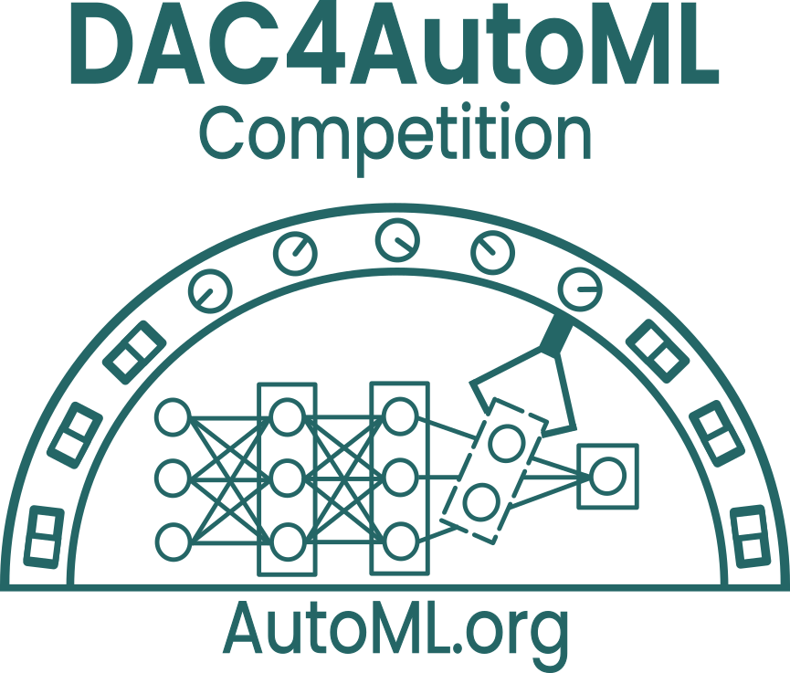
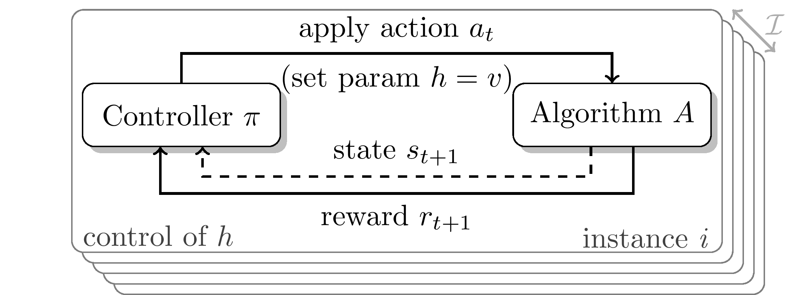
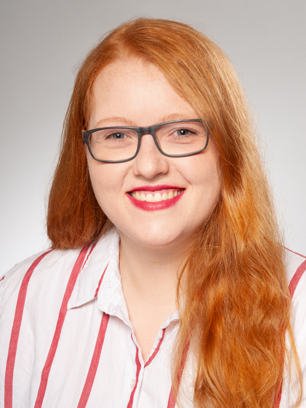

# DAC4AutoML Competition 2022

Welcome to our DAC4AutoML competition! We challenge you to dynamically adapt hyperparameters for Deep Learning (DL) and Reinforcement Learning (RL). For this we provide two challenges: DAC4SGD and DAC4RL. For details on the challenges as well as the general competition rules, check out the CodaLab pages below.

### Motivation

Hyperparameters in Deep Learning (DL) and Reinforcement Learning (RL) are often adjusted online, while learning. This dynamic adaptation is most commonly achieved using handcrafted heuristics ([Battiti et al., 2008](https://core.ac.uk/download/pdf/11829614.pdf); [Kingma and Ba, 2015](https://arxiv.org/pdf/1412.6980.pdf); [Loshchilov and Hutter, 2017](https://arxiv.org/pdf/1608.03983.pdf); [Drake et al., 2020](https://nottingham-repository.worktribe.com/OutputFile/3010925)) and, more rarely, using a (meta-)learned control policy ([Daniel et al., 2016](https://www.microsoft.com/en-us/research/wp-content/uploads/2016/04/daniel2016stepsizecontrol.pdf); [Sharma et al., 2019](https://dl.acm.org/doi/10.1145/3321707.3321813); [Gomoluch et al., 2020](https://arxiv.org/pdf/1810.09923.pdf); [Almeida et al., 2021](https://arxiv.org/pdf/2106.00958.pdf)). We believe there is still a lot of potential for finding more such sophisticated solutions that generalize better to different problem settings. Therefore, this competition builds upon the Dynamic Algorithm Configuration (DAC) framework ([Biedenkapp et al., 2020](https://ml.informatik.uni-freiburg.de/wp-content/uploads/papers/20-ECAI-DAC.pdf)) to provide a competition setting that tests both the quality of hyperparameter configuration policies as well as their generalization capabilities.

#### Dynamic Algorithm Configuration

Dynamic Algorithm Configuration is a generalization of the well-known paradigms of Algorithm Configuration and Per-Instance Algorithm Configuration ([Birattari et al., 2002](https://dl.acm.org/doi/10.5555/2955491.2955494); [Ansótegui et al., 2009](https://link.springer.com/chapter/10.1007/978-3-642-04244-7_14); [Kadioglu et al., 2010](https://dl.acm.org/doi/10.5555/1860967.1861114); [Xu et al., 2010](https://www.cs.ubc.ca/~hoos/Publ/XuEtAl10.pdf); [Lindauer et al., 2022](https://www.jmlr.org/papers/volume23/21-0888/21-0888.pdf)). Instead of finding a single configuration for a set of problem instances or a configuration per instance, DAC finds a policy for adjusting the configuration at every step of the target algorithm (see Figure down below). This leads to a configuration that is able to adapt to the current state of algorithm execution. The effectiveness of this approach has been demonstrated far before DAC was formally introduced, with early successful applications in, e.g., recursive algorithm selection ([Lagoudakis and Littman, 2000](https://dl.acm.org/doi/10.5555/645529.657981)), heuristic optimization ([Battiti and Campigotto, 2012](http://citeseerx.ist.psu.edu/viewdoc/summary?doi=10.1.1.228.9719); [López-Ibánez and Stützle, 2014](https://lopez-ibanez.eu/doc/LopStu2014ejor.pdf); [Kadioglu et al., 2017](https://cs.adelaide.edu.au/~markus/pub/2017lion-reactiveRestarts.pdf); [Sae-Dan et al., 2020](https://hal.archives-ouvertes.fr/hal-02895548)) or limited settings in machine learning ([Daniel et al., 2016](https://www.microsoft.com/en-us/research/wp-content/uploads/2016/04/daniel2016stepsizecontrol.pdf); [Hansen, 2016](https://arxiv.org/pdf/1604.00772.pdf); [Fu, 2016](https://arxiv.org/abs/1606.01467); [Xu et al., 2017](https://arxiv.org/pdf/1705.11159.pdf), [2019](https://arxiv.org/pdf/1909.09712.pdf); [Almeida et al., 2021](https://arxiv.org/pdf/2106.00958.pdf)). The DAC framework presents a novel view on Algorithm Configuration, unifying previous research on dynamic hyperparameter adaptations from different fields and formalizing its objectives ([Biedenkapp et al., 2020](https://ml.informatik.uni-freiburg.de/wp-content/uploads/papers/20-ECAI-DAC.pdf)). Since then, there has been steady progress with significant improve- ments in domains like AI Planning ([Speck et al., 2021](https://www.tnt.uni-hannover.de/papers/data/1503/21-ICAPS-DAC-PLAN.pdf)) and Evolutionary Computation ([Shala et al., 2020](https://ml.informatik.uni-freiburg.de/wp-content/uploads/papers/20-PPSN-LTO-CMA.pdf)). We hope to spark similar progress in DL and RL using the framework of DAC in this competition. Therefore, the competition focuses on discovering dynamic hyperparameter schedules for two problem settings, using any method you can come up with.

### Challenge: DAC4SGD

While DAC has been applied to Computer Vision problems before ([Daniel et al., 2016](https://www.microsoft.com/en-us/research/wp-content/uploads/2016/04/daniel2016stepsizecontrol.pdf); [Xu et al., 2017](https://arxiv.org/pdf/1705.11159.pdf); [Almeida et al., 2021](https://arxiv.org/pdf/2106.00958.pdf)), the research thus far has yet to yield practical online hyperparameter adaptation policies. Furthermore, the associated code often has not even been released and the experimental setups have been hard to replicate from the papers alone. In short, the challenge can be described as follows:

- Goal: Dynamically adapt the learning rate of the SGD optimizer
- Based on the extended version of the SGDBenchmark included in DACBench.
- Provided baselines: Static learning rate, cosine annealing ([Loshchilov and Hutter, 2017](https://arxiv.org/pdf/1608.03983.pdf)), reduce learning rate on pleateu ([Pytorch](https://pytorch.org/); [Paszke et al., 2019](https://openreview.net/pdf?id=BJJsrmfCZ)) and a basic RL agent.
- CodaLab competition page: [https://codalab.lisn.upsaclay.fr/competitions/3672](https://codalab.lisn.upsaclay.fr/competitions/3672)

### Challenge: DAC4RL

In Reinforcement Learning, dynamic configuration is common but does not currently target transfer or generalization ([Jaderberg et al., 2017](https://arxiv.org/pdf/1711.09846.pdf); [Parker-Holder et al., 2020](https://arxiv.org/pdf/2002.02518.pdf); [Awad et al., 2021](https://ml.informatik.uni-freiburg.de/wp-content/uploads/papers/21-IJCAI-DEHB.pdf)) either across variations of the same environment or across different environments. As a first step towards tackling this challenge, we will provide variations of five environments through different contexts for the CARL environments ([Benjamins et al., 2021](https://arxiv.org/pdf/2110.02102.pdf)). Different contexts would then represent different train and test settings on which the participants’ approaches would be tested. This would explicitly encourage better transfer of hyperparameters between different contexts as envisioned in [Kirk et al. (2021)](https://arxiv.org/pdf/2111.09794.pdf) and further progress on the DAC for RL state-of-the-art. In short, the challenge can be described as follows:

- Goal: Dynamically adapt the hyperparameter configuration of a stable_baselines3 agent
- Based on 5 CARL environments
- Provided baselines: Static configurations and learned configuration schedule found by state-of-the-art AutoRL tool PB2 ([Parker-Holder et al., 2020](https://arxiv.org/pdf/2002.02518.pdf))
- CodaLab competition page: [https://codalab.lisn.upsaclay.fr/competitions/3727](https://codalab.lisn.upsaclay.fr/competitions/3727)

### Dates
Submission starts on the **04.04.2022** and is possible throughout the training phase until the ~~18.06.2022 AOE~~ **09.07.2022 AOE** (extended deadline). Afterwards we will evaluate the submissions and announce the results at the AutoML-Conf 2022.

### Awards

We will provide you with certificates of participation (physical as well as digital), including your placement and medals for the top 3 teams of each track. Further prizes for the top 3 teams are copies of the AutoML book signed by the editors. These teams will also receive monetary prizes sponsored by ChaLearn:

- 250$ for first place
- 150$ for second
- 100$ for third

### Organizers
The DAC4AutoML competition is organized by the [AutoML Freiburg-Hannover group](https://www.automl.org/).

<table class="center">
  <tr>
    <td></td>
    <td></td>
    <td></td>
  </tr>
  <tr>
    <td><a href= "https://www.tnt.uni-hannover.de/staff/eimer/">Theresa Eimer </a></td>
     <td><a href= "https://ml.informatik.uni-freiburg.de/profile/rajan/">Raghu Rajan </a></td>
     <td><a href= "https://www.tnt.uni-hannover.de/staff/mohan/">Aditya Mohan </a></td>
  </tr>
 </table>

<table class="center">
  <tr>
    <td></td>
    <td></td>
    <td></td>
  </tr>
  <tr>
    <td><a href= "https://github.com/goktug97"> Göktuğ Karakaşlı</a></td>
    <td><a href= "https://www.tnt.uni-hannover.de/staff/benjamin/">Carolin Benjamins </a></td>
    <td><a href= "https://ml.informatik.uni-freiburg.de/profile/adriaensen/">Steven Adriaensen </a> </td>
  </tr>
 </table>
 
 
<table class="center">
  <tr>
    <td></td>
    <td></td>
  </tr>
  <tr>
    <td><a href= "https://ml.informatik.uni-freiburg.de/profile/hutter/">Frank Hutter </a></td>
    <td><a href= "https://www.tnt.uni-hannover.de/staff/lindauer/">Marius Lindauer </a></td>
  </tr>
 </table>
